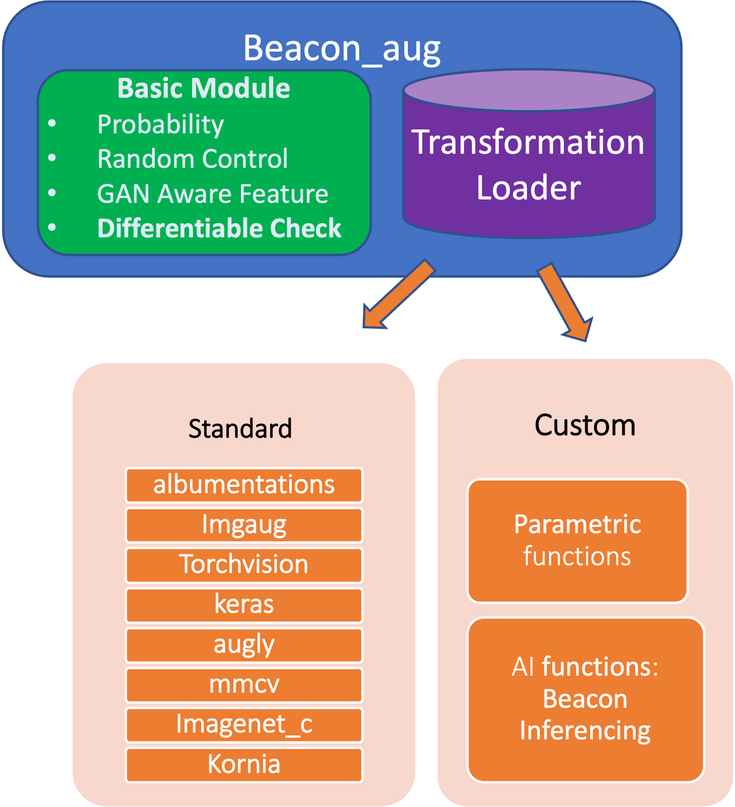
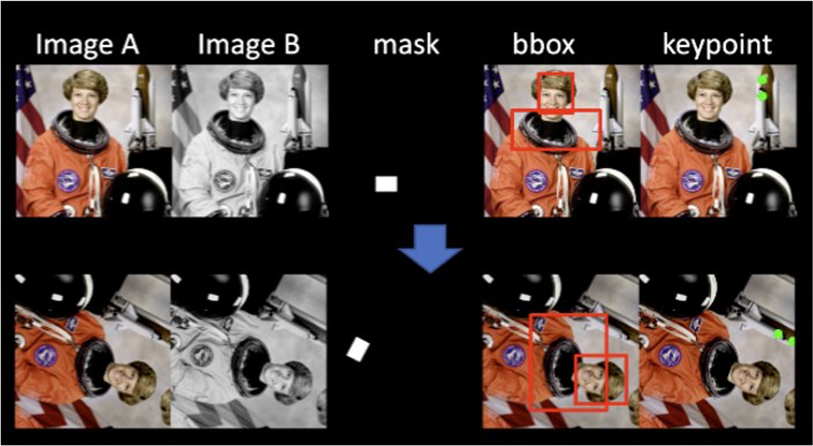
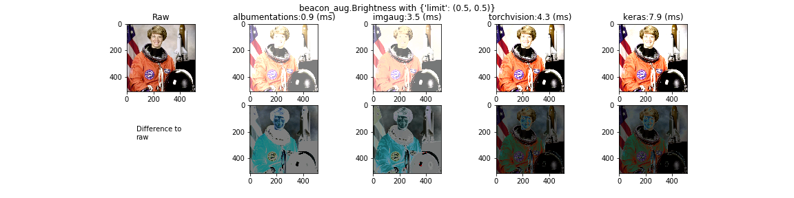

Beacon-aug
==========

- A cross-library image augmentation module for deep learning training
  

## Check our [**website**](https://adobe-research.github.io/beacon-aug/) for user instructions


## Collaborative projects in Adobe Research

- [x] [Hide and Seek Augmentation](https://github.com/kkanshul/Hide-and-Seek) (@ Krishna kumar Singh)
- [x] TextFlow: Text synthesis (@Zhifei zhang )
- [x] CAI: Image Fingerprinting for Network Robustness (@ Maksym Andriushchenko)
- [x] [Effect of Anti-aliasing resize function to FID ](https://github.com/GaParmar/clean-fid) (@Richard Zhang) 
- [ ] [GAN ensembling](https://github.com/chail/gan-ensembling) (@Lucy Chai @ Richard Zhang)
- [ ] PS Research team: mmcv, Resize  
- [ ] human-data-texture-augmentation

## Contributors

- Module building: Rebecca Li, Yannick Hold-Geoffroy, Geoffrey Oxholm
- Customized functions and advanced properties contributing: Richard Zhang, Maksym Andriushchenko, Krishna Kumar Singh, Zhifei Zhang


Why Beacon-aug
---------------

<p align="center">
  
</p>

- [x] Incorporate the largest number of image augmentation operations(\> **300**) from **8** popular libraries
- [x]  [Seamless cross library exchanging](https://adobe-research.github.io/beacon-aug/ipynbs/tutorial_img.html#2.-Result-comparision-for-all-backend-libraries) over different libraries
- [x]  Adobe [featured customized functions](https://adobe-research.github.io/beacon-aug/operator%20overview.html#customized-operators) of both **parametric** and **GAN based** transformations designed by Adobe Researchers
- [x]  Run external [AI function inferencing](https://adobe-research.github.io/beacon-aug/ipynbs/tutorial_GAN_base.html) as easy as general augmentation
- [x]  [Advanced transformation pipelines](https://adobe-research.github.io/beacon-aug/operator%20overview.html#advanced-operators) for complex tasks (e.g. segmentation, detection, GAN training, network robustness)
- [x]  Support various input formats : [np.array,PIL](https://adobe-research.github.io/beacon-aug/ipynbs/tutorial_img.html) , [Torch.tensor](https://adobe-research.github.io/beacon-aug/ipynbs/tutorial_torch.html)
- [x]   Extend the high-level attributes from Albumentations to other libraries by dynamic loading
- [x]  [Differentiable check, anti-aliasing](https://adobe-research.github.io/beacon-aug/properties.html) for operators
- [x]  [Fast-visualization](https://adobe-research.github.io/beacon-aug/ipynbs/tutorial_img.html#4.-Display-a-fast-screenshot-of-the-pipeline) of the augmentation pipeline
- [x]  Easy to add customized functions for [public contributors](https://adobe-research.github.io/beacon-aug/contribute.html#propose-your-customize-functions)
- [x]  Image augmentation module for Adobe's GAN showcase package `beacon` (	🆕  available now!)


Install
=======

How to install
--------------

``` {.sourceCode .bash}
pip install git+https://github.com/adobe-research/beacon-aug
```

How to develop
--------------

``` {.sourceCode .bash}
git clone https://github.com/adobe-research/beacon-aug.git

conda create -y -n aug python=3.7
conda activate aug

python setup.py develop   # for developer 
```

`import beacon_aug` will now directly link to the package in the cloned directory, easing development.

How to use
----------

``` {.sourceCode .python}
import beacon_aug as BA
aug = BA.HorizontalFlip(p=1,  library="albumentations")
image_auged = aug(image=image)["image"]
```

Check [tutorials](https://adobe-research.github.io/beacon-aug/ipynbs/tutorial_img.html) for more examples:

<p align="center">
 
 
</p>


Operator Overview
=================

Basic Operators
---------------

### Customized Operators

-   check this [instructions](https://adobe-research.github.io/beacon-aug/operator%20overview.html#customized-operators) to add customized functions
-   Contributors:
    -   TextFlow: Zhifei Zhang @zzhang
    -   HidePatch: Krishna kumar Singh @krishsin

``` {.sourceCode .python}
BA.{CustomizedOperator}(library="custom")
```

#### Standard Operators:

Beacon\_aug support all the operators in all standard libraries

``` {.sourceCode .python}
BA.{StandardOperator}(library={library})
```

-   Check [this list](https://github.com/adobe-research/beacon-aug/tree/master/beacon_aug/generator/standard/library_remain.yaml) for the operators supporting **one** library
-   Check [the chart](https://adobe-research.github.io/beacon-aug/operator%20overview.html#standard-operators) for the operators supporting **multiple** libraries


Advanced Operators
------------------

-   Check [here](https://adobe-research.github.io/beacon-aug/ipynbs/tutorial_img.html#7.-Example-of-AutoAugment) for user instruction


Trouble Shooting
=======

-   Check [here](https://adobe-research.github.io/beacon-aug/trouble%20shooting.html) 
-   If you have troubles not solved, try the `prune` version by simply reinstall `beacon-aug`  replacing  `requirements.txt` with `requirements_prune.txt` in a new virtual environment


Citation
=======

```bibtex

@misc{beacon-aug2021,
  author = {Li, Xiaoyang Rebecca
            and Hold-Geoffroy, Yannick
            and Oxholm Geoffrey
            and Singh, Krishna Kumar
            and Zhang, Zhifei Zhang
            and Zhang, Richard
            and Andriushchenko, Maksym
            and others},
  title = {Beacon-aug: A cross-library image augmentation toolbox.},
  howpublished = {\url{https://github.com/adobe-research/beacon-aug}},
  year = {2021},
  note = {Online; accessed Jan-11-2022}
}
```